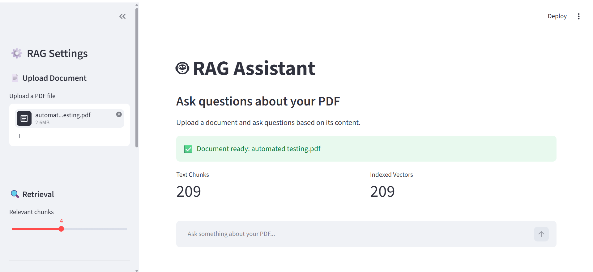
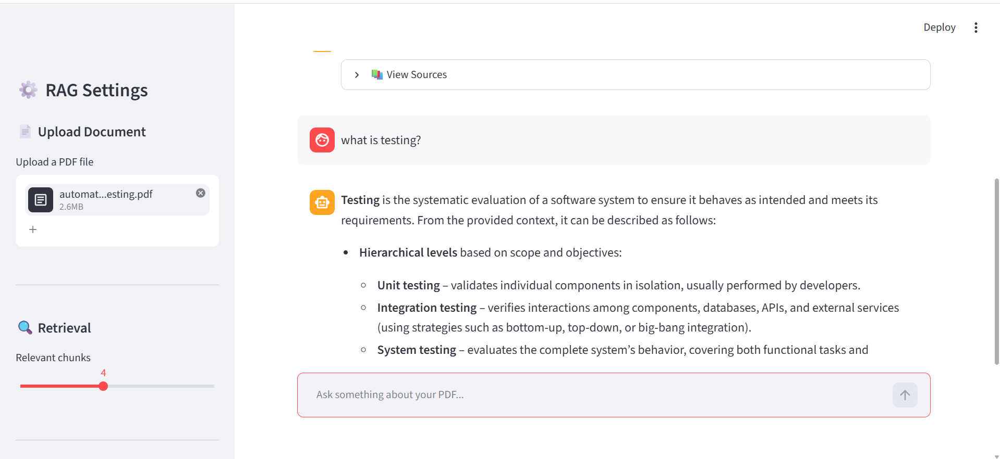
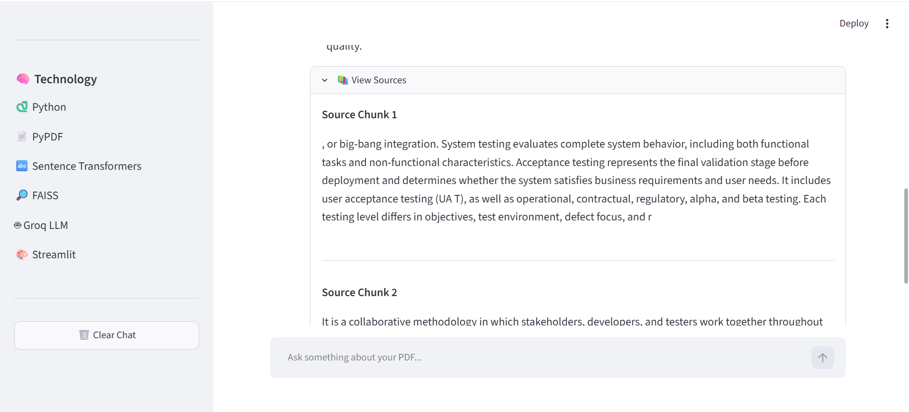

# RAG Assistant

An AI-powered document question-answering assistant built using Retrieval-Augmented Generation (RAG).

## Overview

RAG Assistant allows users to upload a PDF document and ask questions about its content. The system retrieves relevant document chunks using semantic similarity search and generates context-grounded responses using an LLM.

## Features

- PDF document upload
- PDF text extraction
- Text chunking with overlap
- Sentence Transformer embeddings
- FAISS vector similarity search
- Top-k relevant chunk retrieval
- Groq LLM integration
- Context-grounded question answering
- Interactive Streamlit chat interface
- Chat history
- Source chunk inspection
- Configurable retrieval settings

## Application Screenshots

### Main Interface


### Question Answering


### Retrieved Sources



## Architecture

PDF Upload

   ↓
Text Extraction

   ↓
Text Chunking

   ↓
Sentence Transformer Embeddings

   ↓
FAISS Vector Index

   ↓
Semantic Retrieval

   ↓
Relevant Context

   ↓
Groq LLM

   ↓
Generated Answer

## Tech Stack

- Python
- Streamlit
- PyPDF
- Sentence Transformers
- FAISS
- NumPy
- Groq API
- python-dotenv

## Project Structure

```text
rag-engineering-assistant/
│
├── app.py
├── rag_pipeline.py
├── requirements.txt
├── .gitignore
├── README.md
│
└── data/
    └── documents/